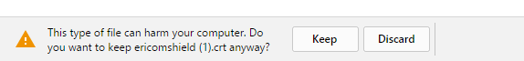
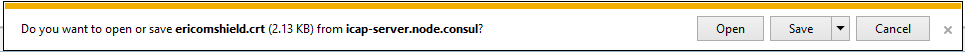
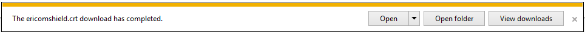
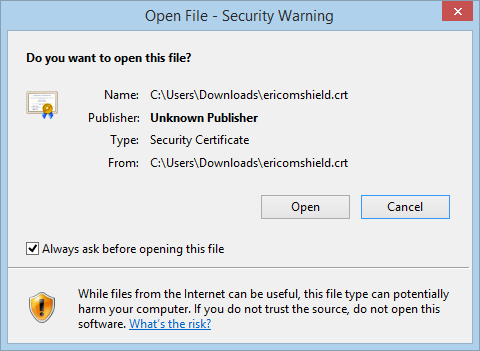
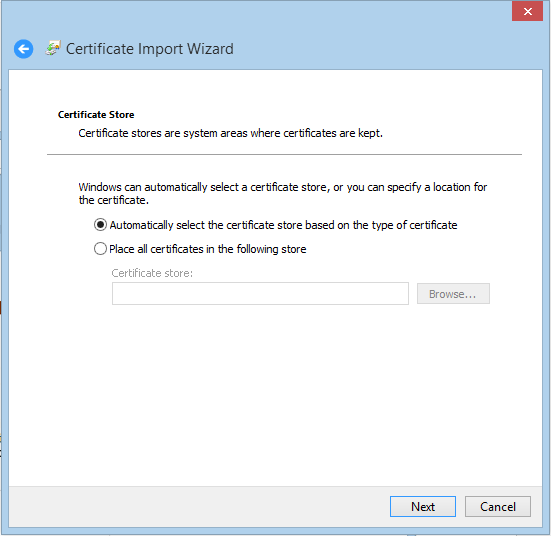
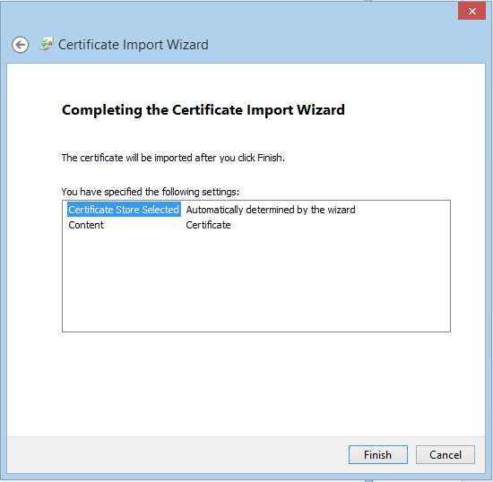

Chrome
======

Once you click the ``Download Certificate`` link, the following prompt is displayed:

	
	*Certificate Downloads Confirmation*
	
Click the “Keep” option, and the file ericomshield.crt is saved in the Downloads folder.

Go to the Downloads folder and open the .crt file. The following dialog is opened:

	
	*Certificate Download*

Click ``Open``

	
	*Certificate Open Dialog*

Click ``Open``

	
	*Certificate Security Warning*

Click ``Open``

.. figure:: images/installcertificate.png
	:scale: 75%
	:alt: Install Certificate
	:align: center
	
	*Install Certificate Dialog*
	
Click ``Install Certificate``

.. figure:: images/importwizard1.png	
	:scale: 75%
	:alt: Certificate Import Wizard
	:align: center
	
	*Certificate Import Wizard*

Click ``Next``

	
	*Certificate Import Wizard*
	
Click ``Next``

	
	*Certificate Import Wizard*
	
Click ``Finish``	

An acknowledge message is displayed:

.. figure:: images/importwizardfinish.png	
	:scale: 75%
	:alt: Certificate Wizard Complete
	:align: center
	
	*Certificate Import Wizard Complate*
	
Click ``OK``	

Now the certificate is successfully installed in IE browser and you can browse HTTPS websites.	

