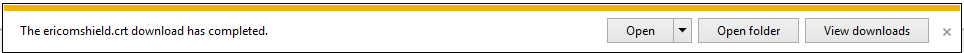
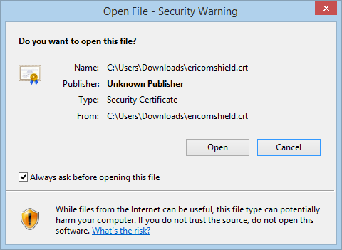
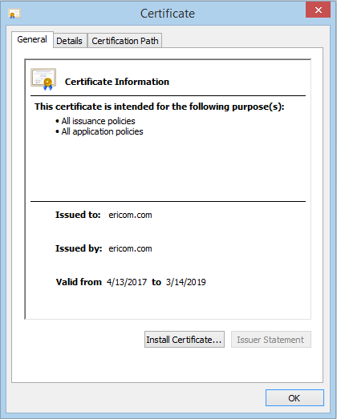
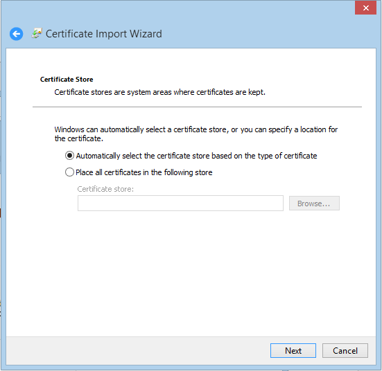
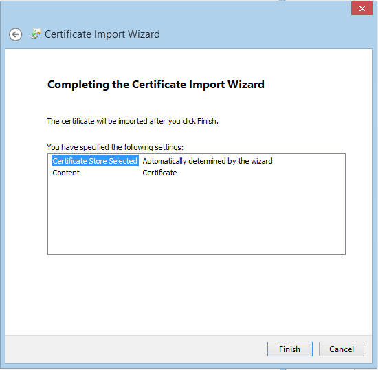
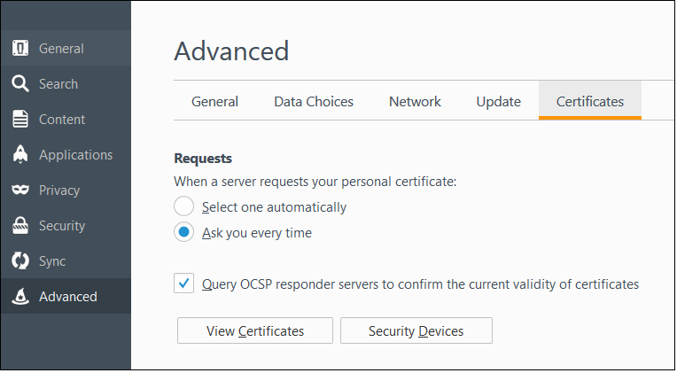
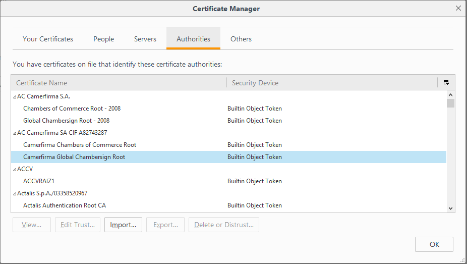
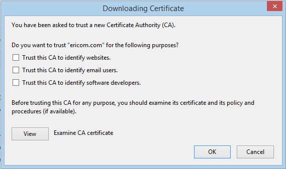

Firefox
=======

Once you click the ``Download Certificate`` link, the following prompt is displayed:

.. figure:: images/firefoxdownloadcomfirmation.png
	:scale: 75%
	:alt: Download Cert
	:align: center
	
	*Certificate Download*
	
Click ``Save File``. The file ericomshield.crt is saved in the Downloads folder. Go to the Downloads folder and open the .crt file. The following dialog is opened:	

.. figure:: images/downloadcert.png
	:scale: 75%
	:alt: Download Cert
	:align: center
	
	*Certificate Download*

Click ``Open``

	
	*Certificate Open Dialog*

Click ``Open``

	
	*Certificate Security Warning*

Click ``Open``

	
	*Install Certificate Dialog*
	
Click ``Install Certificate``

.. figure:: images/importwizard1.png	
	:scale: 75%
	:alt: Certificate Import Wizard
	:align: center
	
	*Certificate Import Wizard*

Click ``Next``

	
	*Certificate Import Wizard*
	
Click ``Next``

	
	*Certificate Import Wizard*
	
Click ``Finish``	

An acknowledge message is displayed:

.. figure:: images/importwizardfinish.png	
	:scale: 75%
	:alt: Certificate Wizard Complete
	:align: center
	
	*Certificate Import Wizard Complate*
	
Click ``OK``	

Next, open a browser and import the certificate into the browser itself: 
In the browser, go to **Tools | Options | Advanced | Certificates**:

	
	*Firefox Certificates*

Click ``View Certificates``

	
	*Firefox Certificate Manager*

Under the Authorities tab, click ``Import...``

In the displayed dialog, select the .crt file and click ``Open``:

	
	*Firefox Certificate Trust Manager*

Check all three options to Trust the certificate and click ``OK``.

Now the certificate is successfully installed and added as a trusted authority in Firefox browser and you can browse securely in HTTPS websites.
	

Now the certificate is successfully installed in IE browser and you can browse HTTPS websites.	

