################
Deployment Guide
################

***********************
What is Ericom Shield®?
***********************

Ericom Shield is a remote virtual browser solution. The actual browsing takes place in a secure, isolated container that has no access to the Local Area Network. The Ericom Shield deployment can be on premise in the DMZ or in the Cloud. Ericom Shield is managed via a web-based administration console.

Ericom Shield enables users to safely browse the internet while protecting the local machine and the network from any malicious code which may execute within the browser. In an event that malicious code is present in the page, it is contained and isolated within the container itself, therefore preventing infection of the local machine or network. When the session ends, the container is destroyed, and therefore any infection within the container is also destroyed.

In addition, the Administrator has finite control over file downloads, the system contains black and white lists for any downloads, including a system wide ban of file downloads. If downloads are allowed, then file sanitization occurs seamlessly in the background before the file is delivered to the user.

Ericom Shield can be used with any browsers and end point device. All that is required is to configure the device (browser) with the location of the Ericom proxy server.

Ericom Shield is deployed on Linux-based containers. Each browsing session starts in its own dedicated container. All sessions are routed by the Ericom Shield Proxy server, ensuring optimal resource allocation and high availability.

*******************
Shield Architecture
*******************

.. figure:: images/Architecture_f1.png	
	:scale: 75%
	:alt: Ericom Shield Architecture 
	:align: center

	*figure 1: Ericom Shield Architecture*

A user navigates to a desired web page by entering a URL address in the browser address bar.

HTTP requests are sent to the proxy server (either enterprise or the embedded Shield proxy). The proxy server acts an intermediate and delivers the desired web page to the user.

The proxy server is connected to the Ericom ICAP (Internet Content Adaptation Protocol) server in the Shield Core, which processes the given URL according to the predefined policies (white list, black list etc.) as configured by the Administrator.

If the URL is not a black listed site then the Shield Core allocates a Shield Browser from the available browser pool, a new dedicated container is assigned for the session and the desired URL is opened and delivered to the user.

The Shield Browser allows the user a seamless browsing experience, including all commonly used features such as video, audio, printing, downloading, according to the defined policies created by the System Administrator.

When downloading a file, the downloaded file is first sent to the Content Disarm and Reconstruct (CDR) engine, which is designed to deconstruct the file and remove any content that can cause potential harm (both known and unknown threats). Once the file sanitization is complete, the sanitized file is sent to the user.

************
Key Features
************

Ericom Shield has the following key features:

* Enables users to browse the internet safely and securely while isolating the users’ machine and the internal network from threats of malware and ransomware.

* Seamless user experience with zero installation on the end point devices – users benefit from the same experience as a non-protected browser, but without the risks.

* Rich web based administration console, supported by all browsers. The Admin interface does not require any high maintenance plug-ins or installers.

* Includes a policy engine to allow Administrators to easily manage which sites users can access, download files, store cookies etc.

******************
Installation
******************

Software Requirements
=====================

Ericom Shield requires Linux Ubuntu 16.04 and above.

Hardware Requirements
=====================

Minimum hardware specifications are 64GB memory, 8 core processors and 40GB disk space per shield server.

.. note:: A higher spec machine will host more virtual containers and therefore more browser sessions.  For example 50 cores and 140GB would support approx. 350 virtual containers.

Evaluation
==========

The evaluation installation method uses an OVF Virtual Appliance image to allow for speedy deployment. This is described fully in the “Ericom Shield Evaluation Guide”.

Production
==========

For an Ericom Shield production system, you can install using either a Vagrant file or Installation script. It’s recommended to use the Installation script (detailed below).

All deployment options install a dedicated service that first installs Ericom Shield on the machine from scratch. Once done, the service can be used to stop and restart the containers. In addition, Ericom Shield includes an Auto-Update feature to ensure it is always up to date with the latest release. The auto update feature checks for updates each time it is started. 

**********
Installers
**********

Virtual Appliance
=================

Prerequisites
-------------

VirtualBox on Windows/Linux:

Linux: open a terminal and run::
 
	$ apt install virtualbox 

For Windows, download from... https://www.virtualbox.org/wiki/Downloads

Vagrant File
============

Prerequisites
-------------

The first step is to install Vagrant and VirtualBox on Ubuntu, as detailed above, please ensure that your Ubuntu server is 16.04 or above.

To install, open a terminal window or SSH to the Linux machine and run::

	$ apt install vagrant
	$ apt install virtualbox

Deployment
----------

Create a folder with the name: ``Vagrant``. Change to this folder by typing ``cd Vagrant`` and then run the following commands::

	$ “wget https://raw.githubusercontent.com/ErezPasternak/Shield/master/Dev-Feb16/Vagrantfile”
	$ chmod +x Vagrantfile
	$ vagrant up
	

	

.. note:: The “vagrant up” command may take a while to complete, especially if this is the first time you have run this command on the machine.

After the process is successfully completed, the user is displayed with the following data: the VM’s IP and several ports of interest.

*******************
Installation Script
*******************

Prerequisites
=============

Ubuntu 16.04 - to install, follow the instructions `here <https://www.ubuntu.com/download/desktop/install-ubuntu-desktop>`_

Deployment
==========

Open a terminal window or connect to the Linux machine using SSH, create a new temporary folder and go to this folder.

Run the following commands::

	$ wget https://raw.githubusercontent.com/ErezPasternak/Shield/master/Dev-Feb16/ericomshield-setup.sh
	$ sudo chmod +x ericomshield-setup.sh
	$ sudo ./ericomshield-setup.sh

The script may take several minutes to complete. At the end of the script you should see that the deployment is successful.

Ericom Shield is installed in ``/usr/local/ericomshield``.

***********************
Post Installation Steps
***********************

Proxy Configuration
===================

After installing Ericom Shield, the system is ready to use. In order to start browsing securely using Ericom Shield, the Browsing Traffic should be send to an HTTP proxy.

If a Proxy server is already in use (for caching or content filtering purpose), this proxy should be configured to work with Ericom Shield.

Alternatively, the browser will be configured to use the Ericom Shield build-in Proxy.

Integrate with existing proxy

In this cases where the organization already has a proxy server. The existing Proxy server should be configured to connect to the Ericom Shield ICAP server. The ICAP Server is running on the Ericom Shield Server and is listening on port 1433. Configure the exiting server to connect to the Ericom Shield ICAP server on port 1443 using the IP address noted above.

There may also be a need to import the certificates detailed below into the existing proxy server to allow support for https navigation.

Shield Proxy
============

Select your browser of choice and define the Proxy Settings to use the Shield Client IP address (as noted from section 2.2) and 3128 port. These settings can be changed manually as described in the links below, or via Group Policy.

Firefox: 
http://www.wikihow.com/Enter-Proxy-Settings-in-Firefox

Chrome and IE: (*done via the Local Internet Properties*):
https://customers.trustedproxies.com/knowledgebase.php?action=displayarticle&id=10

Using the EricomShield Service
==============================

The ericomshield service provides the ability to easily perform certain actions on the Ericom Shield system, using a terminal window directly on the host or connected via SSH.

The following actions are available using the service:

* **start**: starts the service
* **stop**: stops the service
* **status**: shows the status of the service
* **version**: shows the service version
* **restart**: stops and restarts the service

The required syntax is sudo service ericomshield <command> e.g.::

	$ sudo service ericomshield status

You should see the following to show that the system is running.

.. figure:: images/ericomshieldstatus_f2.png	
	:scale: 75%
	:alt: Ericom Shield status
	:align: center

	*figure 2: Ericom Shield Status*

Browsing HTTPS sites 
====================

**Windows** 

In order for Shield to handle HTTPS URLs, the following certificates need to be imported into the client machine (Local Computer). This can be done via Group Policy or manually. 
 

 Save the following certificates locally: 

	:download:`ca.cert.crt <downloads/ca.cert.crt>`.
	:download:intermediate.crt <downloads/intermediate.crt>.
  
 
**Deploy certificates using Group Policy:**

To deploy certificates using Group Policy, follow the instructions detailed below: 
 
1. Open Group Policy Management Console. 
2. Find an existing or create a new GPO to contain the certificate settings. Ensure that the GPO is associated with the domain, site, or organizational unit whose users you want affected by the policy. 
3. Right-click the GPO, and then select **Edit**. 
4. Group Policy Management Editor opens, and displays the current contents of the policy object. 
5. In the navigation pane, open **Computer Configuration | Windows Settings | Security Settings | Public Key Policies | Trusted Publishers**. 
6. Click the **Action** menu, and then click **Import**. 
7. Follow the instructions in the **Certificate Import Wizard** to find and import the certificate. 
8. If the certificate is self-signed, and cannot be traced back to a certificate that is in the **Trusted Root Certification Authorities** certificate store, then you must also copy the certificate to that store. In the navigation pane, click **Trusted Root Certification Authorities**, and then repeat steps 5 and 6 to install a copy of the certificate to that store. 

	
	
.. note:: More details can be found in this `TechNet Article <https://technet.microsoft.com/en-us/library/cc770315%28v=ws.10%29.aspx?f=255&MSPPError=-2147217396>`_ 

**Manual Installation**

Go to **Manage Computer Certificates**, and select **Trusted Root Certification Authorities**

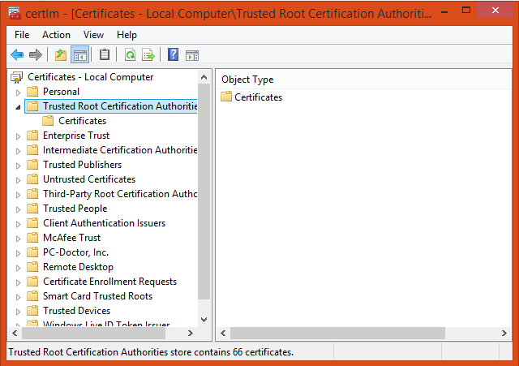

	*figure 3: Certificate (local computer)*

Right click on **Certificates** in Trusted Root… and select **All Tasks | Import**

	*figure 4: Import Certificates*

The **Certificate Import Wizard** opens, click **Next** and browse to the folder containing the saved certificates. Select one of them and click **next**, **next** and **Finish** (accepting the defaults). Repeat the process with the second certificate. 

Some browsers, e.g. Firefox, require importing the certificates into the browser itself.

To import the certificates into Firefox, follow these steps: 
Run Firefox, go to **Tools | Options | Advanced | Certificates | View Certificates**. Under the Authorities tab, click **Import**... add the certificate as a trusted authority.  Repeat for the second certificate as well.

**Mac OSX Configuration:**

For instructions on how to import certificates in Mac OS, click `here <https://www.sslsupportdesk.com/ssl-installation-instructions-for-apple-mac-os-x-10-11/>`_

You may have different screens if your Mac is running a different OSX version than the one shown, in such case check with your documentation on the correct method for installing certificates.

******************
OPSWAT Integration
****************** 

Ericom Shield includes a third-party scanning engine as part of the Internet Content Adaptation Protocol (ICAP) Server.  This scanning engine integrated into the ICAP Server using CDR which helps secure your web traffic and extend the protection of your organisation against advanced threats by scanning and sanitizing any files that pass through it. 

CDR stands for “Content Disarm and Reconstruct”, this engine is designed to deconstruct the file and remove any content that can cause potential harm (both known and unknown threats).  Once the file sanitization is complete, the sanitized file is sent to the user.

.. note:: Any scanning engine available today cannot provide 100% protection from malware.  In essence the scanning engine reduces the risk, and therefore any protection policy should include a combination or black and white listed sites and CDR to obtain a higher level of overall protection.

*****************************************
Clustering Multiple Ericom Shield Servers
*****************************************

AWAITING CONTENT FOR HERE>>>>>

*************
Admin Console
*************

To launch the web based Administration Console go to ``http://<ShieldServerIPaddress>:8181``

Where the ``<Shield Server IP address>`` is the one noted in the deployment section earlier.

.. figure:: images/adminuiloginscreen.png
	:scale: 75%
	:alt: Admin UI Login Screen
	:align: center

	*figure 5: Admin Console Login Screen*

The web interface is optimized for 1440 pixel horizontal resolution.

**Default credentials:**

	**Username:** admin
	
	**Password:** ericomshield

Select the UI Language
======================

To change the user interface language of the Admin console, click on the context menu at the upper right corner to open the settings screen:

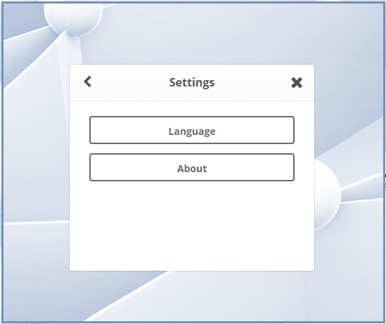

	*figure 6: Settings*
	
Select the Language

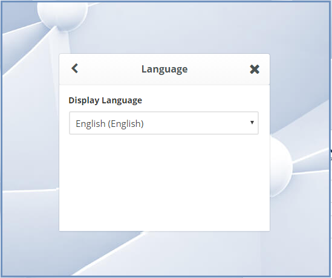

	*figure 7: Language*
		
		
Select the desired language from the list, log in to the system - the user interface will use the selected language.
		

Using the Administration Console
================================

The web based administration console is comprised of the following panels:

Navigation Panel
----------------

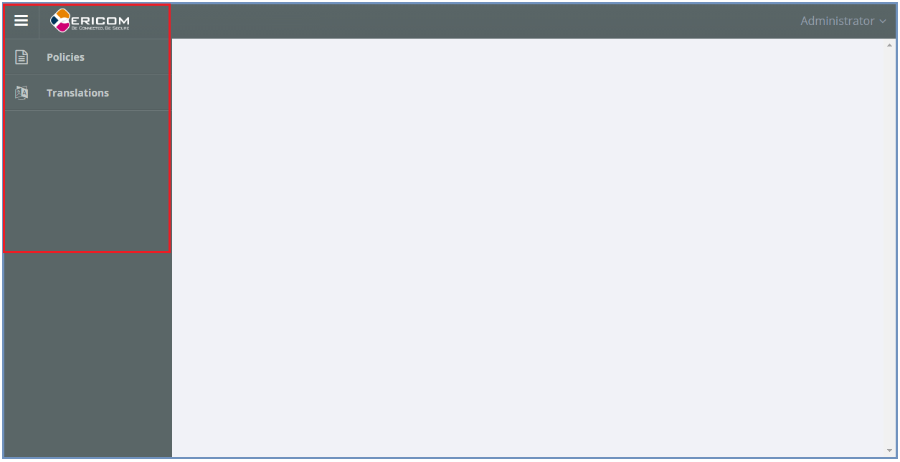

	*figure 8: Admin Console Navigation*

The navigation panel is located on the far left side of the console. It displays the configuration options available to the Administrator. 

Main Panel
==========
 
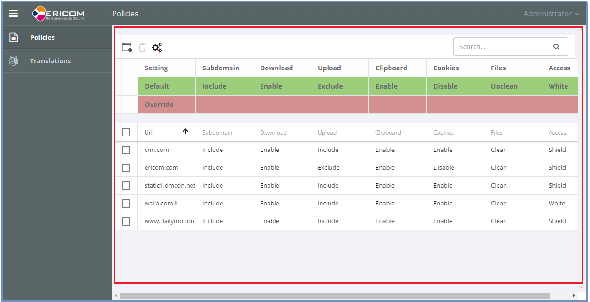

	*figure 9: Admin Console Main Panel*

The main panel is located in the middle area of the console. It displays the high level information and configuration options related to the menu item selected. 

Tooltips
========

Hovering the mouse over an icon in the main panel will display a tooltip message to assist with configuration.

*********
Dashboard
*********

>>>>>>>>>>>> TBD... will add later <<<<<<<<<

********
Policies
********

In this section, policies can be defined system wide or for an individual URL.  

The available actions are: ``Add New URL``, ``Delete`` and ``Toggle View``.

 
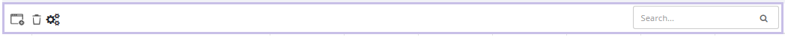

	*figure 10: Admin Console Toolbar*
	
In addition, there is a search box, allowing the admin user to search for a certain URL.
	

Default Policy
==============

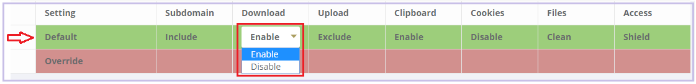

	*figure 11: Default Policy*
	
	
The System Default policy is displayed in the dedicated row (in green) in the upper section of the Policies table.  You may need to use the ``Toggle View`` option in order to see it.

To update an option within the default policy, click the dropdown list for the required option and set the required default value. 

Configuring a Policy
====================
The following options can be controlled within a Policy, either at the system default level or for specific URLs defined within the Policy engine.

.. note:: A specified URL will take priority over the system default policy, except in cases where the override values have been used, see next section for more details on overriding a policy.

**Sub-domain** – define whether the URL’s sub-domains are included or not

.. note:: Example: URL is defined as west.examle.com. If this option is enabled, the user would also have access to east.example.com without having to explicitly add this to the URL section.

* **Download** – define if a file may be downloaded from the specified URL
* **Upload** - define if a file may be uploaded to the specific URL
* **Clipboard** – enable or disable the clipboard usage  
* **Cookies** – enable or disable the usage of cookies (bi-directionally)

.. note:: It’s important to note that globally blocking cookies will prevent most sites that use some form of authentication unusable.  This is because those sites will store an authentication cookie on your machine (usually encrypted).   
In essence the main reason to block cookies is to prevent tracking cookies, this type of third party cookie allows other sites and so advertisers to read them, throwing up those annoying adds related to something you searched for last week.
As blocking all cookies may cause issues with some sites needed by the organization, a policy of black and white lists can provide the best of both worlds.

* **Files** – define whether downloaded files are sanitized or not
* **Access** – define whether the URL is:

	1.	Shield - opened via Ericom Shield
	2.	White - opened without going through the Ericom Shield system
	3.	Black - cannot be opened at all.

	
Override Values
===============

In the case where an organization has many pre-defined URLs, there may be a situation where the system Administrator wishes to override ALL policies either permanently or on a short term basis.  For example, a blanket ban on file downloads, this may be due to recent security events or a change in company policy.  
Instead of having to open each policy and amend the required setting, it’s possible to use the override option in the default policy, and this will then override any setting which has been set in an individual policy.
	
 

	*figure 12: Default Policy*
 
To apply an override, click on the required option in the override section of the default policy. A drop down list is opened, displaying the possible values for the policy. Select the desired value and the override value is set. 
Once an override value has been set, the entire column is marked in red, to visually highlight that an override value has been set.

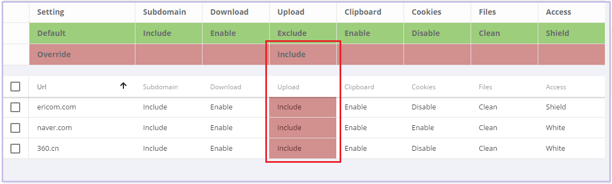

	*figure 13: Override Default Policy*

Override values take precedence over existing policies values and provides an efficient way to apply changes quickly thus improving overall protection in times where certain threats may be high. 

To remove an override value and return the system to the previous settings, simply click the existing value, select the empty entry in the dropdown list. 

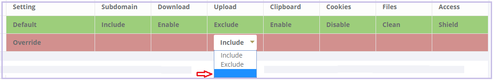

	*figure 14: Remove Override*

The override value is removed, and the previously set values are retrieved and displayed in the table.

Add New URLs
============

	
To Add URLs to the Policies table, press the ``Add New URL`` icon. 

This function opens the following dialog:

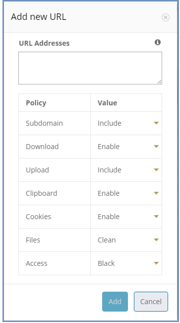

	*figure 15: Add New Policy Dialog*

The dialog opens with the current system default options applied. 
Add the URLs in the ``URL Addresses`` field. Multiple addresses can be added, separated with a new line.
Define the required option(s) for this policy using the drop-down list of values. Once complete, click the “Add” button.

Validation checks are performed on the URL that you entered, as follows:
*	Verify that the URL is valid – if not, a message is displayed and the dialog remains opened, allowing the Administrator to modify the URL.
*	Verify that the URL is not a duplicate.  In such a case, a message is displayed to say the URL already exists. The dialog remains open, allowing the user to modify the URL.  This is to prevent the same URL having different options applied in multiple policies. 

If a URL is marked as ``White`` listed in the Access policy, a notification is issued to the Administrator, confirming that only the specific URL is allowed, and any redirects from this site, will NOT be allowed unless they are also configured as ``white`` listed URL’s. 

Once the validation checks are successfully completed, the dialog closes and the new URLs are displayed in the table.

Modify an Existing URL
======================
It’s possible to modify an existing URL from its entry in the table. All columns can be modified, including the address itself and all policies. To modify a certain entry in the table, simply click the column to update and the entire row become editable.

The URL column is a free text field. Click it and modify the address.

To modify a policy - select the desired value from the drop-down list.

Once done modifying the specific row – click a different place on the screen and the updated values are validated (same checks are performed as when adding a new URL) and committed. 

********
Settings
********

>>>> WILL CHANGE, THEREFORE WILL ADD LATER <<<<

************
Translations
************

The system comes with English (US) as the default language.  It’s possible to add a new language or to edit the existing language file if you wish to change a message that is displayed to the user for a particular event.

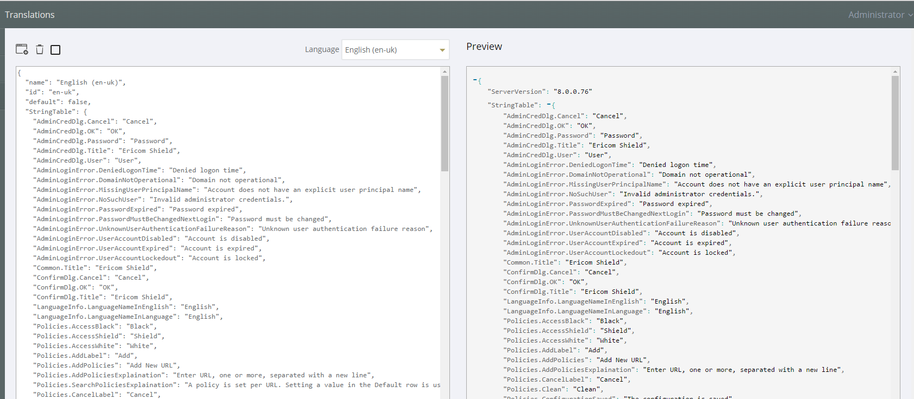

	*figure 16: Language Translations*
	

Add a new Language
==================
Click the Add new language option on the top left of the toolbar.
Enter a name for the required language and the language locale and click save.

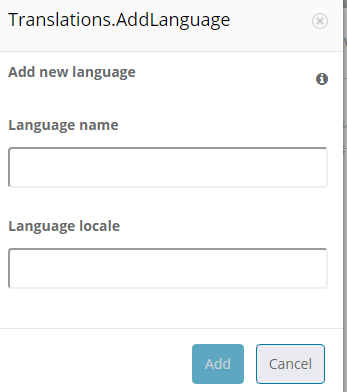

	*figure 17: Add New Language*
	
Select the new Language form the Language drop down list on the toolbar.  Once selected, you can now make any changes to the labels and system messages to your chosen language.  Click “save” once all the changes have been made.

Your new Language will now appear in the list of available Languages.

You can use the same method to adjust any of the system messages, for example you may decide to change...::

	AdminLoginError.MissingUserPrincipalName: Account does not have an explicit user principal name

To the following...::

	AdminLoginError.MissingUserPrincipalName: You Account does not have an explicit user principal name, please contact the helpdesk on ext 455.

*********
Licensing
*********

To activate shield or apply a license extension, first login to the Admin console, select the ``Navigation`` option from the menu.

Send the contents of System ID field to Ericom requesting your extension or activation.   On receipt of your activation key, paste the key into the Activation Key field and click ``Activate`` at the bottom.

The Number of Licenses and License Expiration Date should now present the updated license information.   No service restart is required.

	

