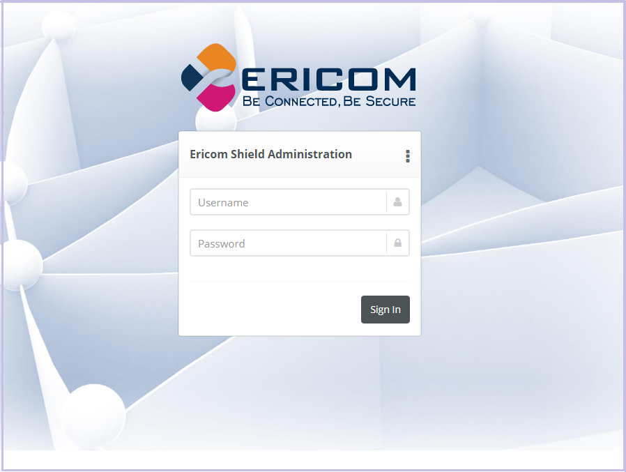
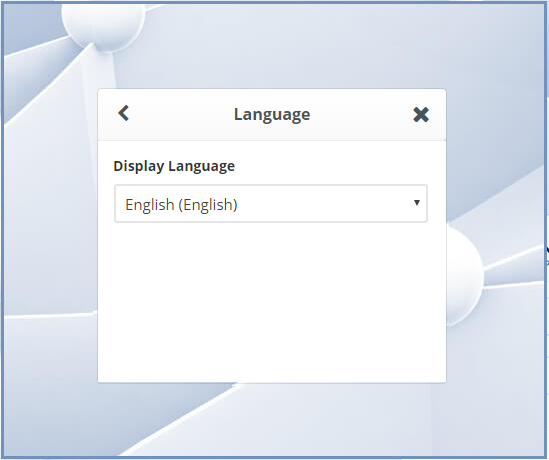

*************
Admin Console
*************

To launch the web based Administration Console go to ``http://<ShieldServerIPaddress>:8181``

Where the ``<Shield Server IP address>`` is the one noted in the deployment section earlier.

	*figure 5: Admin Console Login Screen*

The web interface is optimized for 1440 pixel horizontal resolution.

**Default credentials:**

	**Username:** admin
	
	**Password:** ericomshield

Select the UI Language
======================

To change the user interface language of the Admin console, click on the context menu at the upper right corner to open the settings screen:

.. figure:: images/settings.png
	:scale: 50%
	:alt: Settings
	:align: center

	*figure 6: Settings*
	
Select the Language

	*figure 7: Language*
		
		
Select the desired language from the list, log in to the system - the user interface will use the selected language.
		

Using the Administration Console
================================

The web based administration console is comprised of the following panels:

Navigation Panel
----------------

	*figure 8: Admin Console Navigation*

The navigation panel is located on the far left side of the console. It displays the configuration options available to the Administrator. 

Main Panel
==========
 

	*figure 9: Admin Console Main Panel*

The main panel is located in the middle area of the console. It displays the high level information and configuration options related to the menu item selected. 

Tooltips
========

Hovering the mouse over an icon in the main panel will display a tooltip message to assist with configuration.