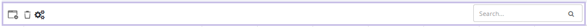
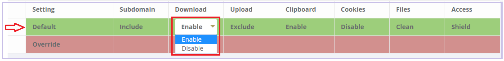
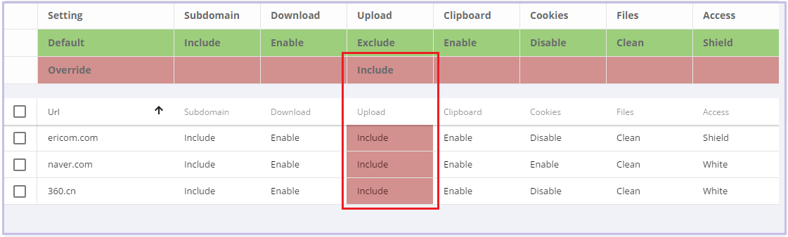
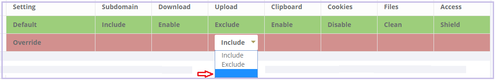
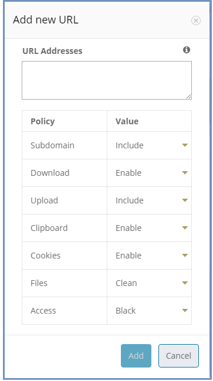

********
Policies
********

In this section, policies can be defined system wide or for an individual URL.  

The available actions are: ``Add New URL``, ``Delete`` and ``Toggle View``.

 

	*figure 10: Admin Console Toolbar*
	
In addition, there is a search box, allowing the admin user to search for a certain URL.
	

Default Policy
==============

	*figure 11: Default Policy*
	
	
The System Default policy is displayed in the dedicated row (in green) in the upper section of the Policies table.  You may need to use the ``Toggle View`` option in order to see it.

To update an option within the default policy, click the dropdown list for the required option and set the required default value. 

Configuring a Policy
====================
The following options can be controlled within a Policy, either at the system default level or for specific URLs defined within the Policy engine.

.. note:: A specified URL will take priority over the system default policy, except in cases where the override values have been used, see next section for more details on overriding a policy.

**Sub-domain** – define whether the URL’s sub-domains are included or not

.. note:: Example: URL is defined as west.examle.com. If this option is enabled, the user would also have access to east.example.com without having to explicitly add this to the URL section.

* **Download** – define if a file may be downloaded from the specified URL
* **Upload** - define if a file may be uploaded to the specific URL
* **Clipboard** – enable or disable the clipboard usage  
* **Cookies** – enable or disable the usage of cookies (bi-directionally)

.. note:: It’s important to note that globally blocking cookies will prevent most sites that use some form of authentication unusable.  This is because those sites will store an authentication cookie on your machine (usually encrypted).   
In essence the main reason to block cookies is to prevent tracking cookies, this type of third party cookie allows other sites and so advertisers to read them, throwing up those annoying adds related to something you searched for last week.
As blocking all cookies may cause issues with some sites needed by the organization, a policy of black and white lists can provide the best of both worlds.

* **Files** – define whether downloaded files are sanitized or not
* **Access** – define whether the URL is:

	1.	Shield - opened via Ericom Shield
	2.	White - opened without going through the Ericom Shield system
	3.	Black - cannot be opened at all.

	
Override Values
===============

In the case where an organization has many pre-defined URLs, there may be a situation where the system Administrator wishes to override ALL policies either permanently or on a short term basis.  For example, a blanket ban on file downloads, this may be due to recent security events or a change in company policy.  
Instead of having to open each policy and amend the required setting, it’s possible to use the override option in the default policy, and this will then override any setting which has been set in an individual policy.
	
 

	*figure 12: Default Policy*
 
To apply an override, click on the required option in the override section of the default policy. A drop down list is opened, displaying the possible values for the policy. Select the desired value and the override value is set. 
Once an override value has been set, the entire column is marked in red, to visually highlight that an override value has been set.

	*figure 13: Override Default Policy*

Override values take precedence over existing policies values and provides an efficient way to apply changes quickly thus improving overall protection in times where certain threats may be high. 

To remove an override value and return the system to the previous settings, simply click the existing value, select the empty entry in the dropdown list. 

	*figure 14: Remove Override*

The override value is removed, and the previously set values are retrieved and displayed in the table.

Add New URLs
============

	
To Add URLs to the Policies table, press the ``Add New URL`` icon. 

This function opens the following dialog:

	*figure 15: Add New Policy Dialog*

The dialog opens with the current system default options applied. 
Add the URLs in the ``URL Addresses`` field. Multiple addresses can be added, separated with a new line.
Define the required option(s) for this policy using the drop-down list of values. Once complete, click the “Add” button.

Validation checks are performed on the URL that you entered, as follows:
*	Verify that the URL is valid – if not, a message is displayed and the dialog remains opened, allowing the Administrator to modify the URL.
*	Verify that the URL is not a duplicate.  In such a case, a message is displayed to say the URL already exists. The dialog remains open, allowing the user to modify the URL.  This is to prevent the same URL having different options applied in multiple policies. 

If a URL is marked as ``White`` listed in the Access policy, a notification is issued to the Administrator, confirming that only the specific URL is allowed, and any redirects from this site, will NOT be allowed unless they are also configured as ``white`` listed URL’s. 

Once the validation checks are successfully completed, the dialog closes and the new URLs are displayed in the table.

Modify an Existing URL
======================
It’s possible to modify an existing URL from its entry in the table. All columns can be modified, including the address itself and all policies. To modify a certain entry in the table, simply click the column to update and the entire row become editable.

The URL column is a free text field. Click it and modify the address.

To modify a policy - select the desired value from the drop-down list.

Once done modifying the specific row – click a different place on the screen and the updated values are validated (same checks are performed as when adding a new URL) and committed. 