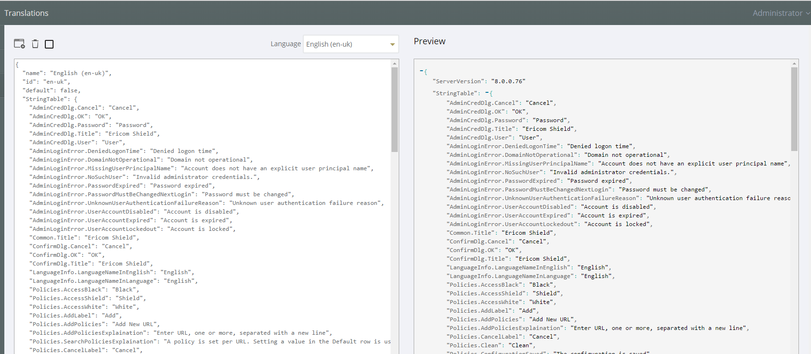
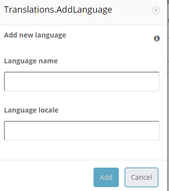

************
Translations
************

The system comes with English (US) as the default language.  It’s possible to add a new language or to edit the existing language file if you wish to change a message that is displayed to the user for a particular event.

	*figure 16: Language Translations*
	

Add a new Language
==================
Click the Add new language option on the top left of the toolbar.
Enter a name for the required language and the language locale and click save.

	*figure 17: Add New Language*
	
Select the new Language form the Language drop down list on the toolbar.  Once selected, you can now make any changes to the labels and system messages to your chosen language.  Click “save” once all the changes have been made.

Your new Language will now appear in the list of available Languages.

You can use the same method to adjust any of the system messages, for example you may decide to change::

	AdminLoginError.MissingUserPrincipalName: Account does not have an explicit user principal name

To the following::

	AdminLoginError.MissingUserPrincipalName: You Account does not have an explicit user principal name, please contact the helpdesk on ext 455.