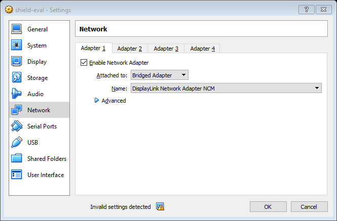
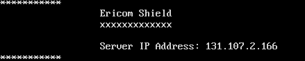
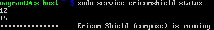

################
Evaluation Guide
################

>>> IN WORK <<<

.. toctree::
	:maxdepth: 2
	:glob:
	
	evaluationguide/whatisericomshield
	evaluationguide/shieldarchitecture

	
************
Requirements
************

Ericom Shield is supplied as a Virtual Appliance in Open Virtualization Format (OVF). The minimum requirements for the appliance are: 3GB RAM, 3 processors and 40GB of disk space.

The appliance can be run on any virtualization platform that supports deployment via OVF. The documentation below will provide details of deployment using Oracle Virtual Box. Oracle Virtual Box can be downloaded from `here <http://www.oracle.com/technetwork/server-storage/virtualbox/downloads/index.html>`_

For evaluation purposes, the appliance is limited to a maximum of 20 browser sessions, i.e. 1 user having 20 tabs open or 20 users with a single tab each.

************	
Installation
************

Download the Ericom Shield appliance from `Google Drive <https://drive.google.com/open?id=0B_wcQRaAT_INcXhsc1E4bXlySWs>`_

Importing the Appliance:
========================

*	Open Oracle VirtualBox
*	From the menu, choose ``File Import | Appliance…``
*	select the downloaded file ``shield_eval.ova``
*	When the image has been imported, select the image and click on settings
*	Change the Network setting to ``Bridged Adapter``

	*Figure 2: Network Settings*
	
	
*	Click ``OK`` to save your settings
*	Start the machine
*	Login using the credentials: ``vagrant/vagrant``
*	You will see the IP Address of your VM, as shown below:  (take a note of this IP address as you will use it later)
	

	*Figure 3: Shield startup screen*	
	
*	Type the following to restart the Ericom Shield Service.  During the restart, Ericom Shield will automatically update itself to the latest version if one is available.::

	$ sudo service ericomshield restart

	Wait until the system is restarted. Once finished, Ericom Shield is ready to handle connections.

*	The ericomshield service is located in ``/usr/local/ericomshield``

If you need to recall the IP address of the appliance at a later date, you can also type::  

	$ sudo ifconfig eth0
	
	
***********************	
Post Installation Steps
***********************

Proxy Configuration
===================
After installing Ericom Shield, the system is ready to use. In order to start browsing securely using Ericom Shield, the Browsing Traffic should be sent to the Ericom HTTP proxy.

For information on how to integrate Ericom Shield with an existing proxy server, see the “Ericom Shield Deployment Guide”.

Shield Proxy
------------
Select your browser of choice and define the Proxy Settings to use the Shield Client IP address (the VM IP address, see “Installation” section) and 3128 port. These settings can be changed manually as described in the links below, or via Group Policy.

**Instructions for common browsers)**
Firefox: http://www.wikihow.com/Enter-Proxy-Settings-in-Firefox
Chrome and IE (done via the Local internet Properties): https://customers.trustedproxies.com/knowledgebase.php?action=displayarticle&id=10

Using the EricomShield Service
==============================

The *ericomshield* service provides the ability to easily perform certain actions on the Ericom Shield system, using a terminal window directly on the host or connected via SSH.

The following actions are available using the service:

*	**start**: starts the service
*	**stop**: stops the service
*	**status**: shows the status of the service
*	**version**: shows the service version
*	**restart**: restarts the service

The required syntax is sudo service ericomshield <command> for example::

	$ sudo service ericomshield status

	*Figure 3: Shield Status*	
	
.. toctree::
	:maxdepth: 2
	:glob:
	
	https/*

 

	
	
	
	
