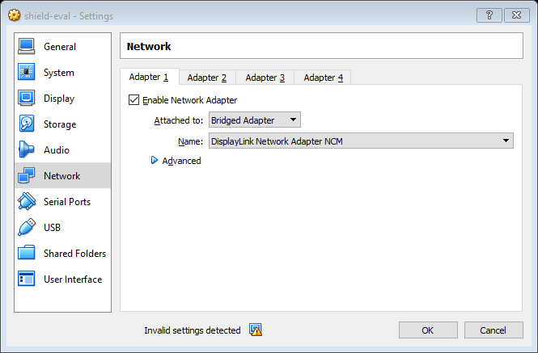
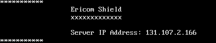

************	
Installation
************

Download the Ericom Shield appliance from `here <https://drive.google.com/open?id=0B_wcQRaAT_INcXhsc1E4bXlySWs>`_

Importing the Appliance:
========================

*	Open Oracle VirtualBox
*	From the menu, choose ``File Import | Appliance…``
*	Select the downloaded file ``shield_eval.ova``
*	When the image has been imported, select the image and click on ``settings``
*	Change the Network setting to ``Bridged Adapter``

	*Figure 2: Network Settings*
	
	
*	Click ``OK`` to save your settings
*	Start the machine
*	Login using the credentials: ``vagrant/vagrant``
*	You will see the IP Address of your VM, as shown below:  (take a note of this IP address as you will use it later)
	

	*Figure 3: Shield startup screen*	
	
*	Type the following to restart the EricomShield Service.  During the restart, Ericom Shield will automatically update itself to the latest version if one is available::

	$ sudo service ericomshield restart

	Wait until the system is restarted. Once finished, Ericom Shield is ready to handle connections.

*	The EricomShield Service is located in ``/usr/local/ericomshield``

If you need to recall the IP address of the appliance at a later date, you can also type::  

	$ sudo ifconfig eth0
