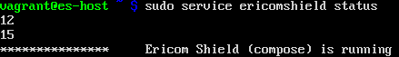

***********************	
Post Installation Steps
***********************

Proxy Configuration
===================
After installing Ericom Shield, the system is ready to use. In order to start browsing securely using Ericom Shield, the Browsing Traffic should be sent to the Ericom HTTP proxy.

For information on how to integrate Ericom Shield with an existing proxy server, see the `Ericom Shield Deployment Guide <../deploymentguide/postinstallationsteps.html>`_.

Using the EricomShield Service
==============================

The *ericomshield* service provides the ability to easily perform certain actions on the Ericom Shield system, using a terminal window directly on the host or connected via SSH.

The following actions are available using the service:

*	**start**: starts the service
*	**stop**: stops the service
*	**status**: shows the status of the service
*	**version**: shows the service version
*	**restart**: restarts the service

The required syntax is sudo service ericomshield <command> for example::

	$ sudo service ericomshield status

	

	
	*Figure 3: Shield Status*	

	
End User Configuration
======================

Select your browser of choice and define the Proxy Settings to use the Shield Client IP address (the VM IP address, see “Installation” section) and 3128 port. These settings can be changed manually as described in the links below, or via Group Policy.

**Instructions for common browsers**

Firefox: 
http://www.wikihow.com/Enter-Proxy-Settings-in-Firefox

Chrome and IE (done via the Local internet Properties): 
https://customers.trustedproxies.com/knowledgebase.php?action=displayarticle&id=10	
	

Configuring Certificates
========================

In order for Shield to handle HTTPS URLs, the following certificate needs to be imported into the client machine (Local Computer). This can be done via Group Policy or manually using the following steps:

Once you have configured your browser to use the Ericom Proxy, opne the browser and go to:

http://install-certificate/ - and download the certificate.

**Installing the Certificate**

.. toctree::
	:maxdepth: 1
	:glob:
	
	../browsers/*

	
