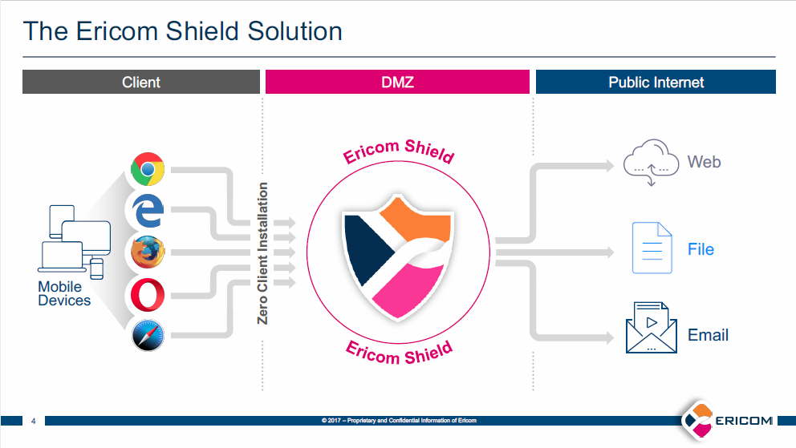

*******************
Shield Architecture
*******************

	*figure 1: Ericom Shield Architecture*

A user navigates to a desired web page by entering a URL address in the browser address bar.

HTTP requests are sent to the proxy server (either enterprise or the embedded Shield proxy). The proxy server acts an intermediate and delivers the desired web page to the user.

The proxy server is connected to the Ericom ICAP (Internet Content Adaptation Protocol) server in the Shield Core, which processes the given URL according to the predefined policies (white list, black list etc.) as configured by the Administrator.

If the URL is not a black listed site then the Shield Core allocates a Shield Browser from the available browser pool, a new dedicated container is assigned for the session and the desired URL is opened and delivered to the user.

The Shield Browser allows the user a seamless browsing experience, including all commonly used features such as video, audio, printing, downloading, according to the defined policies created by the System Administrator.

When downloading a file, the downloaded file is first sent to the Content Disarm and Reconstruct (CDR) engine, which is designed to deconstruct the file and remove any content that can cause potential harm (both known and unknown threats). Once the file sanitization is complete, the sanitized file is sent to the user.
